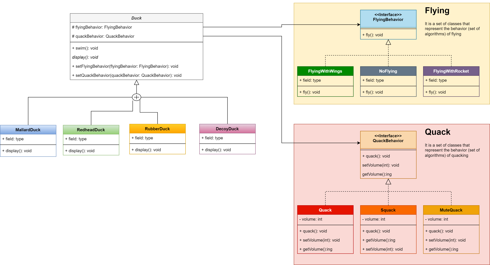

# Strategy Design Pattern

## Example to Build
   - In duck simulation game we have some different types of ducks
   - duck have some characteristics
     - swim
     - display information
     - fly
     - quack
   - All ducks can swim
   - and display information dependent on type
   - some ducks can fly some others cannot
   - quacking there is squack (another sound) and some ducks cannot quack
   - We want to build an application that is flexible for changing to simulate the ducks

## Design

### Basic OO
   - the different types of ducks should have a superclass that has a common state and behavior 
     - we will make the Abstract class Called Duck
       - It has a swim method
       - Abstract method for fly and quack because they vary (This is not the best solution, we will fix it)
       - Abstract method display (to force children to implement it)
       - We here used Polymorphism to make different types of ducks
       - Benefit 
   - Problems
     - Although the design has some flexibility in adding types and using the superclass as a type
     - the problem that implementations of fly & quack are repeated
     - This is the problem when we want to modify for example the way of a normal Quack, we will go to every implementation and modify it (Keep it DRY (Don't repeat yourself))

### OO principles
   - **First principle**: encapsulate what varies
     - this means that the fly varies from one duck type to another
     - the solution is to delegate it
     - We will make a set of Flying behavior
       - FlyWithWings
       - NoFly
       - FlyWithRocket
     - these set of classes should implement a fly method to use it
   - **Second principle**: code to an interface, not an implementation
     - If we want to change the flying Behavior for example from FlywithWings to FlyWithRocket
       - It will be easy if they have an interface to describe this type of set of behaviors and change the behavior
       - So if I make an interface to flying behavior I could use any one of the flying set behavior
         - EX:
            - Assume that you have an interface for a flying set (FlyingBehavior)
            ```java
                FlyginBehavior flytingBehavior = new FlywithWings();
                flyingBehavior.fly() // flyeing with wing  
                flyingBehavior = new FlyWithRocket();
                flyingBehavior.fly() // flyeing with rocket 🚀
            ```
            -  Now you can change the behavior of a duck dynamically
            - Using `new` is against the principle but now you have a high level of flexibility

   - **Third principle**: Favor composition over inheritance
     - So now in Duck, we can add flyBehavior as an instance variable
     - You can set it at any duck type of contructor
     - You can change the behavior at the runtime using `setter`

### Design patterns
    - **Strategy design pattern**: defines a family of algorithms, encapsulates each one and makes them interchangeable. 
    - That is what we have done
      - family of algorithms: flying behaviors 
      - encapsulates each one: put them in classes
      - makes them interchangeable: using interface FlyingBehavior

## Class Diagram


## Why Design patterns
   - It is patterns that solve common OO problems
     - that was not invented but discovered
   - shared pattern vocabulary
     - When I say, I will use Strategy Pattern to solve the fly problem, who knows that pattern can understand how to solve it
     - Makes the design easy

    


